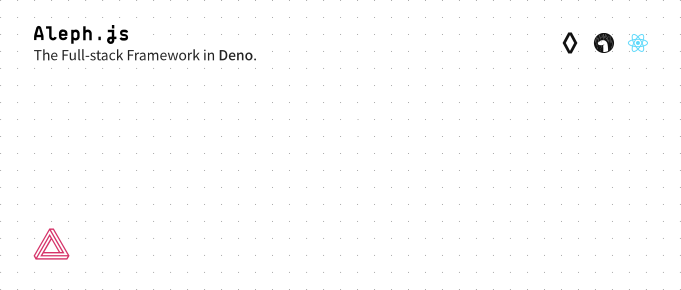

  
  

## Features

- Modern tooling in Deno
- Use standard web API
- Filesystem routing
- Static file server
- Support multiple UI libraries (React/Vue/Sevlet...)
- Server side rendering
- Middlewares
- Plugins
- Severless friendly

## Getting Started

Visit [https://alephjs.org/docs/get-started](https://alephjs.org/docs/get-started) to get started with Aleph.js.

## Community

The Aleph.js community can be found on [GitHub Discussions](https://github.com/alephjs/aleph.js/discussions), where you can ask questions, voice ideas, and share your projects.

To chat with other community members you can join the Aleph.js [Discord](https://discord.com/invite/pWGdS7sAqD).

## Contributing

Please see our [contributing.md](https://github.com/alephjs/aleph.js/blob/master/CONTRIBUTING.md).

## License

[MIT licensed.](https://github.com/alephjs/aleph.js/blob/master/LICENSE)
